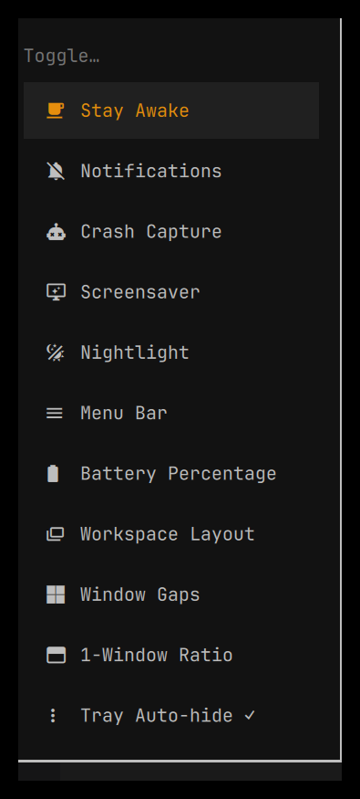

# omarchy-tray-toggle

A drop-in replacement for [Omarchy](https://omarchy.org/)'s stock system tray
widget (`omarchy.tray`) that fixes one bug and adds one setting.


## The bug it fixes

The stock tray widget shows a chevron ("hide/show more icons") that reserves
its own bar space **any time there is at least one tray icon** — even when
every icon is pinned and there is nothing left to hide. That reserved space
also always renders visually as an arrow, so you can never fully get rid of
it through the normal pin/hide menu alone. This plugin only reserves that
space, and only draws the chevron, when there is actually something behind
it to reveal.

## The setting it adds

A new `alwaysShow` option (off by default, same behavior as stock). Turn it
on and every tray icon is always visible — nothing gets pushed behind the
chevron, ever. Off, and it behaves exactly like the stock widget (pin icons
you want to always see, hide icons you never want to see, everything else
sits behind the chevron until you hover it).

## Quickstart

```bash
git clone https://github.com/felipecpaiva/omarchy-tray-toggle.git
cd omarchy-tray-toggle
./install.sh
```

`install.sh` copies the plugin into `~/.config/omarchy/plugins/tray-toggle.tray`
and swaps the bar over from the stock tray widget. It's safe to re-run.

## Turning `alwaysShow` on or off

Right-click a pinned icon opens that app's own menu, not this widget's
settings — so there's no in-bar button for it (a previous version tried a
permanent bar button for this and it looked cluttered). Instead, add a
one-line toggle to your Omarchy launcher (`Super+Space`).

### Add the launcher toggle

Open `~/.config/omarchy/extensions/omarchy-menu.jsonc` and add this entry
(inside the outer `{ }`, alongside your other entries):

```jsonc
"trigger.toggle.tray-autohide": {"icon":"󰇙","label":"Tray Auto-hide","checked":"jq -e '(.bar.layout.right[] | select(.id==\"tray-toggle.tray\") | .alwaysShow) != true' $HOME/.config/omarchy/shell.json >/dev/null 2>&1","action":"jq '(.bar.layout.right[] | select(.id==\"tray-toggle.tray\")) |= (. + {alwaysShow: ((.alwaysShow // false) | not)})' $HOME/.config/omarchy/shell.json > $HOME/.config/omarchy/.shell.json.tmp && mv $HOME/.config/omarchy/.shell.json.tmp $HOME/.config/omarchy/shell.json"}
```

Save the file — it hot-reloads. Then `Super+Space` → "Toggle" → "Tray
Auto-hide" flips it, with a checkmark showing the current state.



If your tray widget lives in a different bar section than `right` (you
moved it with `omarchy bar move`), change `.bar.layout.right[]` in both the
`checked` and `action` commands to match (`.left[]` or `.center[]`).

Requires `jq` (ships with Omarchy).

## Uninstalling

```bash
./uninstall.sh
```

Puts the stock `omarchy.tray` widget back. If you added the launcher
toggle above, remove that line yourself.

## License

MIT
